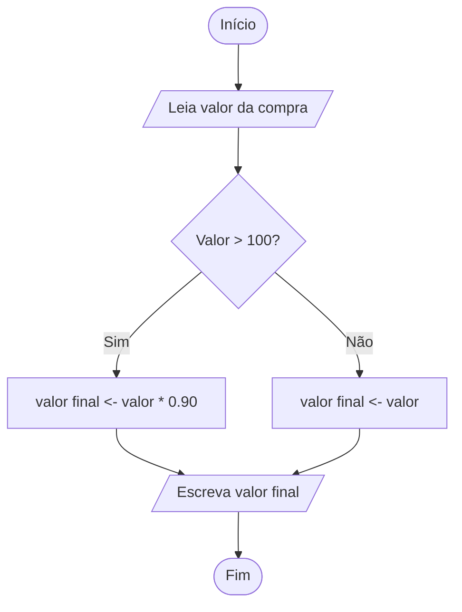

# Exercício 3 — Fluxograma

Abaixo está a representação lógica do algoritmo de desconto:

```mermaid
graph TD
    A([Início]) --> B[/Leia valor da compra/]
    B --> C{Valor > 100?}
    C -->|Sim| D[valor final <- valor * 0.90]
    C -->|Não| E[valor final <- valor]
    D --> F[/Escreva valor final/]
    E --> F
    F --> G([Fim])
```